# **C++面经总结**
## **C++路线图**
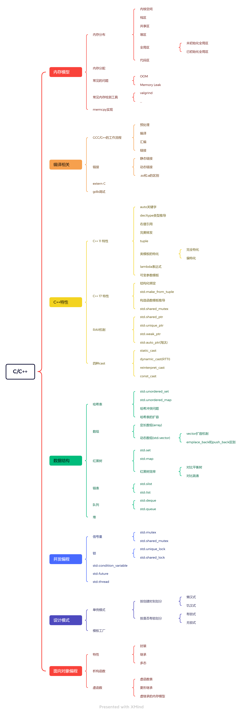

## **内存模型**
首先让我们讲解下内存模型。
### **内存分布**
下面是一张内存分布图
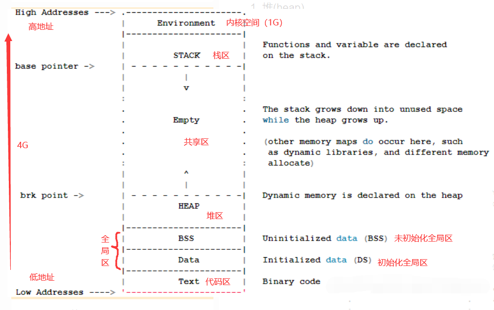
* 从高地址到低地址，一个程序由**内核空间**、**栈区**、**堆区**、**BSS段**、**数据段（data）**、**代码区**组成。
* 可执行程序在运行时会多出两个区域：
  * **堆区**：动态申请内存用。堆从**低地址向高地址增长**。
  * **栈区**：存储局部变量、函数参数值。 栈从**高地址向低地址增长**
* 在堆栈之间有一个**共享区（文件映射区，跟动态库有关系）**。
* **BSS**段：一块存放程序中**未初始化**的**全局变量**和**静态变量**的内存区域。
* **数据段(data)**：一块存放程序中**已初始化**的**全局变量**和**静态变量**的内存区域。
* **代码段**：存放程序执行代码的一块内存区域。只读，不允许修改，代码段的头部还会包括一些**只读的常量**，如**字符串常量字面值**（注意：const变量虽然属于常量，但本质还是变量，不存储于代码段）。


### **内存分配**
#### **栈和堆的区别**
* **申请方式及申请效率不同**
  * 栈是自动申请和释放，堆是程序手动申请和释放。
  * 栈申请的快，而堆申请的慢。
* **能够申请的空间不同**
  * 栈空间最多2M，超过会Overflow。
  * 堆的空间理论可以解决3G。
* **缓存方式不同**
  * 栈是一级缓存，而堆是二级缓存。
* **内存利用率**
  * 栈不会产生内存碎片，而堆是人为申请，容易产生内存碎片。

#### **new、malloc、free、delete关健字**
##### **new和delete**
* 必须成对出现，否则内存泄露，delete的作用是回收用new分配的内存（释放内存），不是new出来的内存是不能用delete删除滴~
* delete一块内存，只能delete一次，不能delete多次。delete后，这块内存就不能用了，空指针可以多次删除但是没有实际意义。 
##### **malloc和free**
* malloc仅仅是分配一块内存,malloc返回值是void*,同理free仅仅是释放一块内存
##### **区别**
* **实际操作**：**new/delete** 调用构造函数并初始化
调用析构函数并释放内存。**malloc和free**申请一段新空间
释放一段空间。
* **本质**：**new/delete**本质是关键字，而**malloc和free**本质是函数。
* **初始化**：**new**会初始化，**malloc**不会初始化。
* **返回值**：**new**返回对象的指针，**malloc**返回的(void *)，需要强制转化对应的指针。
* **限制**：**new**的内存必须**delete**来回收。**malloc**的内存必须
用**free**回收。
### 常见问题
* **OOM**: OOM（**Out Of Memory**）就是我们常说的内存溢出，它是指需要的内存空间大于系统分配的内存空间。
* **Memory Leak**: 内存泄漏(**Memory Leak**)是指程序中已动态分配的堆内存由于某种原因程序未释放或无法释放，造成系统内存的浪费，导致程序运行速度减慢甚至系统崩溃等严重后果。
### 常见的内存检测工具
这里只介绍一种常用检测内存的工具：valgrind。
#### **case 1：排查Invalid Write**
```C++
#include <cstdio>
#include <cstdlib>
int* create(){
    return (int*)malloc(sizeof(int));
}
int main(){
    int *p = create();
    *p = 100;
    printf("%d\n", *p);
    free(p);
    int a = *p;
    return 0;
}
```
* step1.先编译 (-g表示开启gdb调试)  --->这样valgrind可以看到代码行数
```
 g++ -o test2  test2.cpp -g
```
* step2.运行valgrind,--leak-check=no | summary | full：对发现的内存泄露给出的信息级别，只有memcheck可用。
```
valgrind --tool=memcheck --leak-check=full ./test2
```
* step3.查看结果
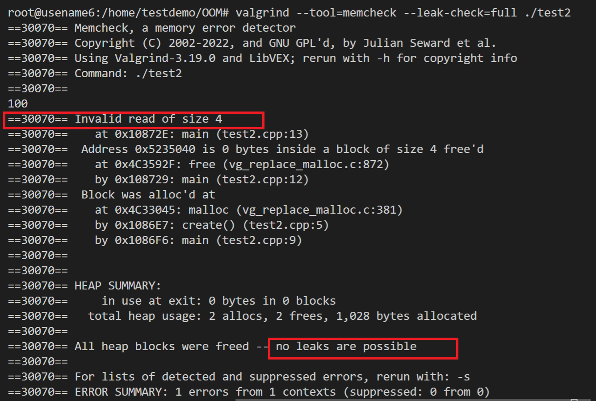

#### **case 2：排查OOM**
```C++
#include <cstdio>
#include <cstdlib>

int main(){
    int* array = (int*)malloc(sizeof(int)*10);
    for(int i=0;i<=10;i++)
        array[i]=i;
    return 0;
}
```
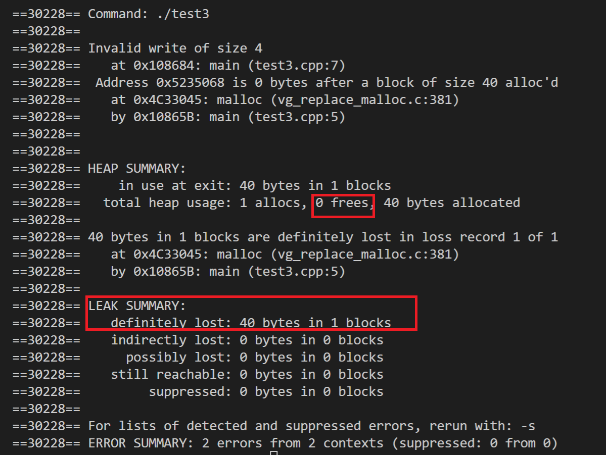

#### **识别valgrind的提示**
* **definitely lost**：确认丢失。程序中存在内存泄露，应尽快修复。当程序结束时如果一块动态分配的内存没有被释放且通过程序内的指针变量均无法访问这块内存则会报这个错误。
* **indirectly lost**：间接丢失。**当使用了含有指针成员的类或结构时可能会报这个错误**。这类错误无需直接修复，他们总是与”definitely lost”一起出现，只要修复”definitely lost”即可。
* **possibly lost**：**当程序结束时如果一块动态分配的内存没有被释放且通过程序内的指针变量均无法访问这块内存的起始地址，但可以访问其中的某一部分数据，则会报这个错误**。
* **still reachable**：可以访问，未丢失但也未释放。如果程序是正常结束的，那么它可能不会造成程序崩溃，但长时间运行有可能耗尽系统资源，因此笔者建议修复它。如果程序是崩溃（如访问非法的地址而崩溃）而非正常结束的，则应当暂时忽略它，先修复导致程序崩溃的错误，然后重新检测。
* **suppressed**：已被解决。
  
### **memcpy实现**
来源一道阿里面试题，如何实现一个严谨的**memcpy**。
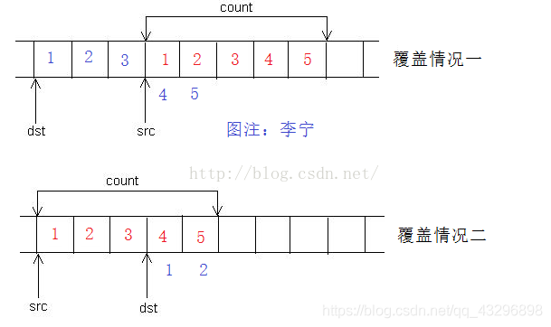
```C++
void memcpy(char * dest, const char * src, int n){
    //Problem 1 重叠问题：dest在src的前面
    //Problem 2 重叠问题：dest在src的后面
    //Tips:不可移动dest的指针
    if((dest==NULL)||(src==NULL)||(n<=0)){
        return NULL;
    }
    char *p=(char*)dest;
    char *q=(char*)src;
    if((dest>src)&&((src+n)>dest)){
        p=p+n-1;
        q=q+n-1;
        while(n--){
            *p++=*q++;
        }
    }else{
        while(n--){
            *p++=*q++;
        }
    }
    return dest;
}
```

## **编译相关**
### **GCC/G++的工作流程**
* **预处理**：也叫预编译。除了#pragma编译指令，其他的#号指令全部完成转换，比如#include的头文件要完成导入，#define的宏要展开，#if的条件编译，注释全部删除。这个过程不会检查错误，生成预处理文件main.ii。
  * **#ifdef** 和 **#endif**
    * **#ifdef**判断某个宏是否被定义，若已定义，执行随后的语句。
    * **#endif** 是 **#if**, **#ifdef**, **#ifndef**这些条件命令的结束标志。
    * 其他的类似的命令还有 **#ifndef**、**#if**等。
  * **#pragma**
    * **#pragma**是预处理指令，它的作用是设定编译器的状态或者是指示编译器完成一些特定的动作。
  * **#define**
    * 常说的宏定义。
* **编译**
  * 这一步是整个全流程的核心步骤。把预处理完的文件main.ii进行词法分析、语法分析、语义分析、优化，生成汇编代码文件main.s。这个过程会**检查语法错误**，也可以通过参数来**屏蔽某些编译警告**。
  * **模板**(**template**)和**内联**(**inline**)在大多数编译器中都是在编译阶段进行处理。template在编译阶段完成具现化。inline在编译阶段将函数调用替换为函数本体，从而减少函数调用的开销。
* **汇编**：该步骤比较简单，它只是把上一步生成的汇编文件main.s翻译成机器指令，输出二进制文件main.o。
* **链接**：链接过程就像堆积木，本质上就是把多个不同的目标文件粘在一起。
  * **动态链接**：动态链接就是把调⽤的函数所在⽂件模块和调⽤函数在⽂件中的 位置等信息链接进⽬标程序，程序运⾏的时候再从中寻找相应函数代码，因此需要相应⽂件的⽀持 。
  * **静态链接**：静态连接库就是把 (lib或者a) ⽂件中⽤到的函数代码 直接链接进⽬标程序 ，程序运⾏的时候不再需要其它的库⽂件。
  * **区别**：动态链接是有需要才会将其整合到代码上，静态链接是不管是否需要都会整合到代码上。


### **extern C**
extern C的作用是告诉C++编译器用C规则编译指定的代码（除函数重载外，extern C不影响C++其他特性）。
### **gdb调试**
* **step1**. 使用ulimit命令，使得C++/C程序在core drump的情况下，能够生成
```
ulimit -c unlimited
```
* **step2**. gcc -g编译，打开调试
```
gcc -g -o test01 test.c
```
* **step3**.只会会生成一个core drump的文件，然后用gdb test01 test01.core，会进入到gdb界面中。
* **常见命令**：
  * **bt**：bt命令的作用书打印程序的堆栈，gdb调试过程中输入bt可以清晰的看到函数的调用路径。where命令也有相同的作用。
  * **frame x**：进入x-th的frame。
  * **down x**：往栈顶方向下移x个frame。
  * **up x**：往栈底方向向上移动x个frame。
  * **info args**：打印出当前函数的参数名称和值。
  * **info locals**：打印出当前函数里所以的局部变量的名字和值。
  * **print x**：打印x变量的值。
  * **help**：帮助命令。
  * **source xx.gdb**：编译xx.gdb脚本，之后可以像函数一样使用这个脚本。

## **C++特性**

## **数据结构**
C++的数据结构通常封装在std中，包括std::map、std::unordered_map、std::set、std::queue、std::priority_queue、std::list等等。下面让我们来逐一介绍这些数据结构。
### **哈希表**
这里主要以std::unordered_map为例，unordered_map是一种用哈希表（HashTable）实现的数据结构，针对哈希冲突，他采用了**链地址法（开链法/哈希桶/拉链法）**的方式（buket桶的结构实现），其中链地址法入下图所示：
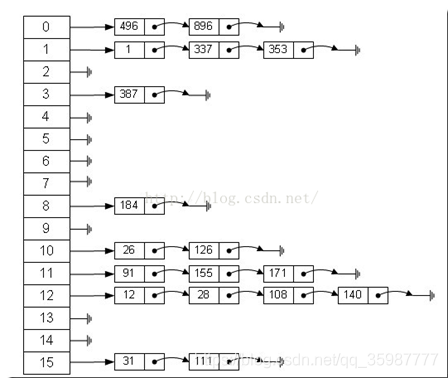

#### **追问：哈希表为什么是线程不安全的？**
* 这里主要指的是Java的HashMap，其在多线程运作的情况下，由于在jdk1.7之前的HashMap是基于数组和单向链表(类似std::forward_list)实现的，HashMap会丢失数据或者数据成环。
* 而在jdk1.8中，在解决哈希冲突时有了较大的变化，当链表长度大于阈值（**默认为 8**）（将链表转换成红黑树前会判断，如果**当前数组的长度小于 64**，那么会选择先进行数组扩容，而不是转换为红黑树）时，**将链表转化为红黑树**，以减少搜索时间。采用尾插法。但是仍会导致数据覆盖的问题。

#### **追问：哈希表的扩容机制是什么？**
* 在这里我们假定哈希表的结构是**std::vector<std::forward_list<std::pair<const Key,  Value>>>**。
* **触发哈希表扩容的时机**：
  * 当当前参数n大于当前桶数(bucket_count)，则会强制进行重散列，新的桶的大小大于或等于n。
  * 当容器的负载系数（load_factor）大于我们设定的阈值，也会进行重散列（rehash）的操作。
```C++
void rehash( size_type n );
```
* 每次扩多大的容量：由于散列函数一般是通过取余实现的，如果当**N**（**即桶的大小**）未非素数的时候，哈希冲突几率会更大，所以我们一般会使用素数，故我们会将哈希表扩容成**最接近2N的一个素数**。

### **数组**
数组存储连续元素的数据结构，他们在内存空间上都是连续的。
#### **array**
就很正常见的int数组、结构体数组、类数组、char数组、bool数组等等。不可动态增长。
#### **std::vector**
vector内部结构是动态增长的连续空间。
* **扩容机制**
假设我们定义vector最大的空间为8，一次性push_back 8个元素，此时有个问题出现，当我们把此时的迭代器即vector的初始位置记录下来，然后push第9个元素，然后此时进行扫描，我们发现有很多乱码，包括我们之前的很多数字都消失了：
```C++
#include <iostream>
#include <vector>
using namespace std;
#define MAX_NUM 9
int main(){
    vector<int> vecInt;
    for(int i = 0; i != MAX_NUM; i++){
        vecInt.push_back(i);
    }
    vector<int>::iterator iter = vecInt.begin();
    cout << "the 1st element: " << *iter << endl;
    vecInt.push_back(123);
    while(iter != vecInt.end()){
        cout << *iter << " ";
        iter++;
    }
    cout<<endl;
    return 0;
}
```
**结果**：
```
0 0 1572753424 21887 4 5 6 7 0 0...
真正的想要的数据，其实在：0 1 2 3 4 5 6 7 123
```
**原因**：这是因为vector本来就是一种动态扩容的数据结构，当没有指定容量的时候，容量是以2的n次幂的方式扩容（均摊的复杂度小），所以当达到8的时候，vector的capacity已经满了，此时我们需要重新申请一段16个int的空间，然后把这段空间copy过去。所以原来迭代器的首地址已经失效。

**值得注意**：Vector扩容倍数与平台有关，在Win + VS 下是 1.5倍，在 Linux + GCC 下是 2 倍。因为和哈希表不同，不需要考虑哈希冲突问题，所以不需要扩充成最接近2N的一个素数。

* **emplace_back和push_back的区别**
```C++
#include <cstdio>
#include <iostream>
#include <vector>
class Person{
    int _age;
public:
    Person(int age) : _age(age){
        std::cout<<"Construct a person. " << _age<<std::endl;
    }
    Person(const Person &p) : _age(p._age){
        std::cout<<"Copy-Construct "<<_age<<std::endl;
    }
    Person(const Person &&p) noexcept: _age(p._age){
        std::cout<<"Move-Construct "<<_age<<std::endl;
    }
};
int main(){
    std::vector<Person> person;
    person.reserve(4);   //为了防止vector扩容，提前申请一段长度为4的空间
    auto p = Person(1);
    auto q = Person(3);
    std::cout<<"1st push_back"<<std::endl;
    person.push_back(p);
    std::cout<<"2nd emplace_back"<<std::endl;
    person.emplace_back(q);
    std::cout<<"3nd emplace_back"<<std::endl;
    person.emplace_back(2);
    std::cout<<"4th emplace_back"<<std::endl;
    person.push_back(4);
    return 0;
}
```
**结果**：
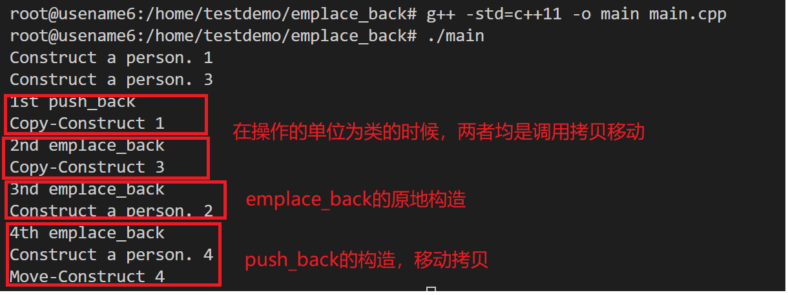
  * **push_back**的特点：
    * 传入的是类，则会先调用复制拷贝（相当于重新开辟一个相同大小的空间，然后进行深拷贝）。
    * 传入的是参数，那么就会先进行构造一个临时对象，然后再调用移动拷贝（把右值移动到vector中，因为临时对象不会再使用）。 
  * **emplace_back**的特点：
    * 传入的是类，和push_back一样会调用复制拷贝函数。
    * 传入的是参数，则会在vector的位置就地构造一个对象，而不需要移动拷贝。
* **capacity和size的关系**
  * capacity: vector真正的容量，是vector向操作系统申请的一段可用的空间的总大小，大于size的空间可能是野的，但是仍可以被使用。
  * size：实际上真正能使用的空间。我们一般用这个来遍历std::vector。
* **vector的reserve的作用**
  * reserve的作用是更改vector的容量（capacity），使vector至少可以容纳n个元素。如果n大于vector当前的容量，reserve会对vector进行扩容。其他情况下都不会重新分配vector的存储空间。
  
### **红黑树**
红黑树是一种不同于平衡树的二叉搜索树，通常二叉搜索树为了保证查找的效率，需要保证树的结构是平衡的：即所有子树下的左右子树的高度最多相差1。那么就会进行多次旋转来满足。而红黑树不需要保证其是完全平衡，效率比平衡树要快。
#### **特性**
* **根节点**必为**黑色**。
* **叶子节点**都为**黑色**，且为 **null**。
* 连接红色节点的两个子节点都为黑色（**红黑树不会出现相邻的红色节点**）。
* **从任意节点出发，到其每个叶子节点的路径中包含相同数量的黑色节点。**
* **新加入到红黑树的节点为红色节点**。
下面是一个红黑树的图例：
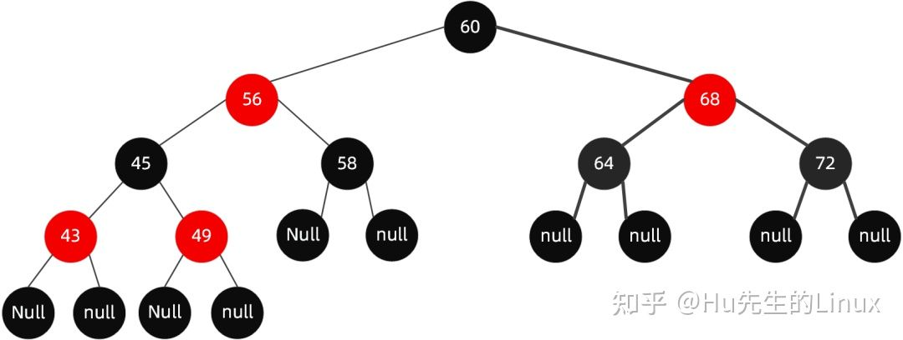
#### **染色规则**
而当我们插入66号节点的时候，新插入的节点的红色，没问题，依然满足红黑树的所有条件:
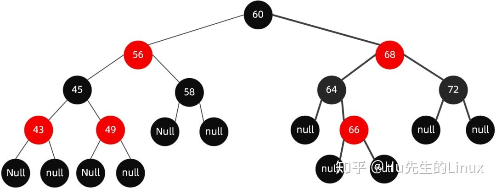
而当我们继续插入51号节点时:
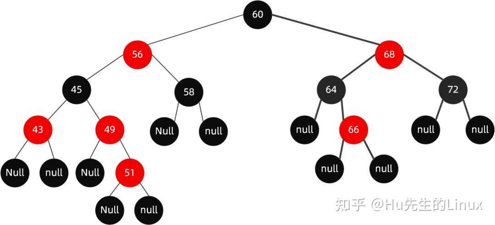
破坏了条件3
此时我们会将其做个变色
* 首先解决结构不遵循规则 4 这一点（红色节点相连，节点 49-51），需将节点 49 改为黑色。
* 此时我们发现又违反了规则 5（56-49-51-XX 路径中黑色节点超过了其他路径），那么我们将节点 45 改为红色节点。
* 又违反了规则 4（红色节点相连，节点 56-45-43），那么我们将节点 56 和节点 43 改为黑色节点。
* 但是我们发现此时又违反了规则 5（60-56-XX 路径的黑色节点比 60-68-XX 的黑色节点多），因此我们需要调整节点 68 为黑色。
最终完成调整：
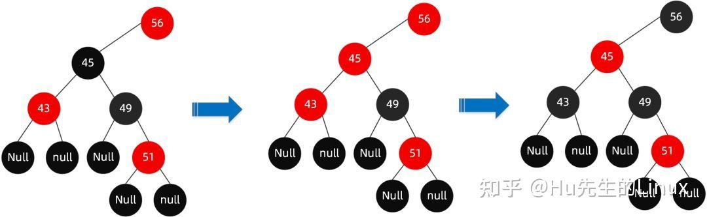
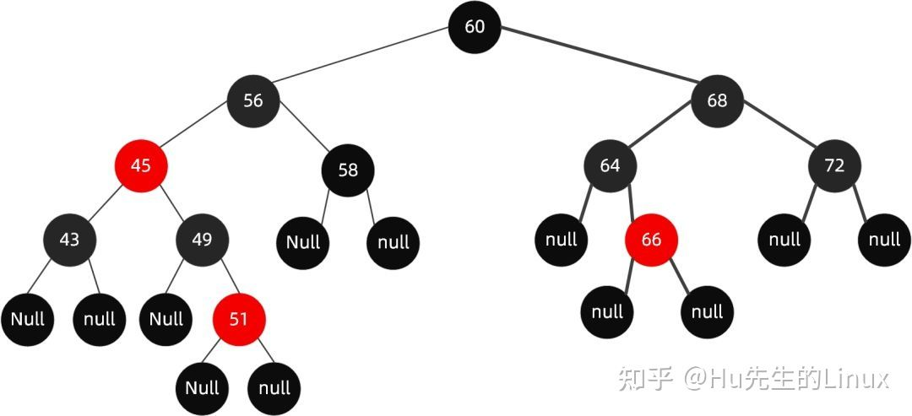
#### **旋转规则**
值得注意的是并不是所有的情况都能用染色的方式接近，当新插入的节点，其父节点是红色，叔父（父亲的兄弟节点）是黑色的时候，变色将失败。此时我们需要通过旋转（这个旋转是类似平衡树的旋转来满足红黑树的规则）。
* **第一种：左左节点旋转**
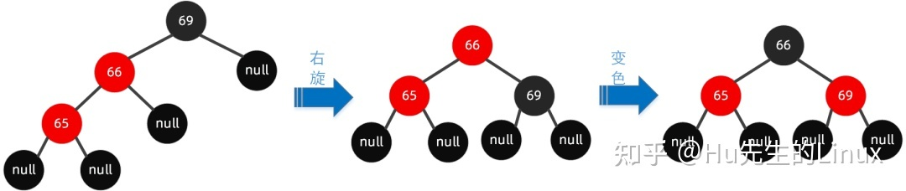
* **第二种：左右节点旋转**
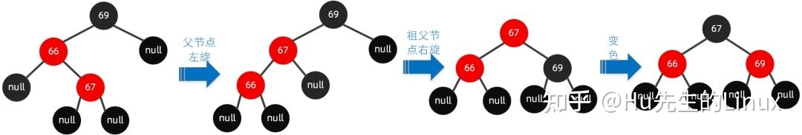
* **第三种：右左节点旋转**
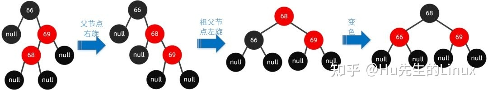
* **第四种：右右节点旋转**
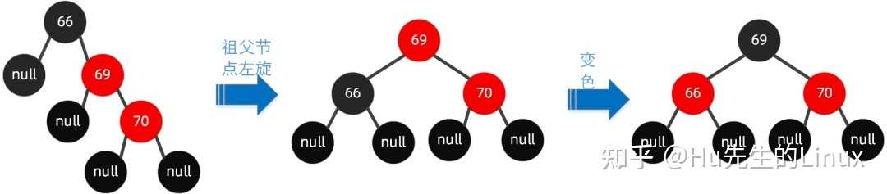
### **堆**
#### **堆的定义**
**堆有三个要点**：
* 堆是**完全二叉树**。
* **大顶堆**：对于每个子树而言，**它的根节点的值一定要比它的左右节点的值大**。
* **小顶堆**：对于每个子树而言，**它的根节点的值一定要比它的左右节点的值小**。

#### **向上调整算法（插入算法）**
我们首先把新来的元素放在堆的最后一个。
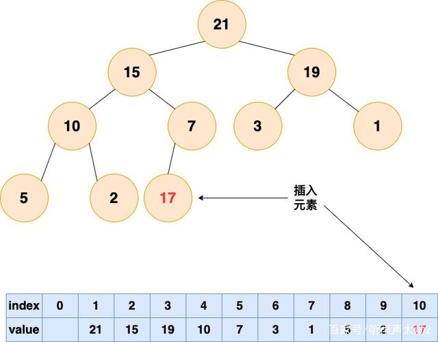
**从底向上，如果父结点比该元素大，则该节点和父结点交换，直到无法交换,可以证明这样的交换最多是logn次。**
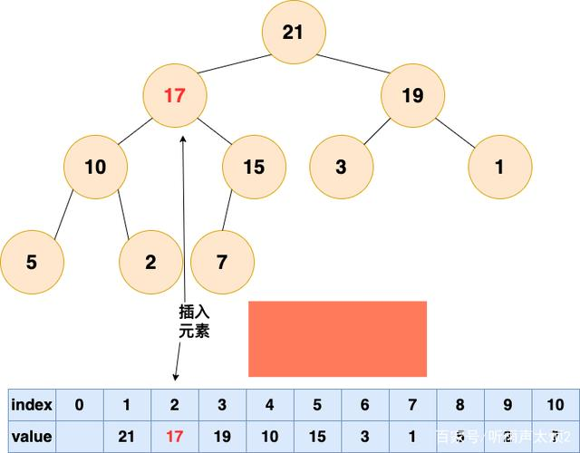
#### **向下调整算法（删除算法）**
**删除堆顶元素，然后将最后一个元素和堆顶的元素交换，而后执行向下调整算法。**
**step 1.删除堆顶元素。**
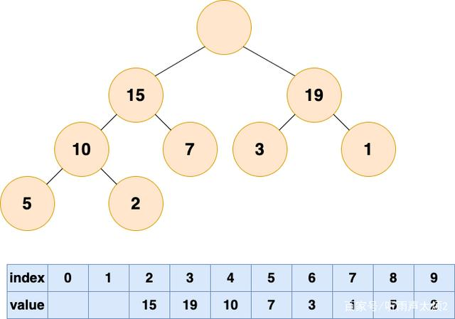
**step 2.将最后一个元素浮到堆顶。**
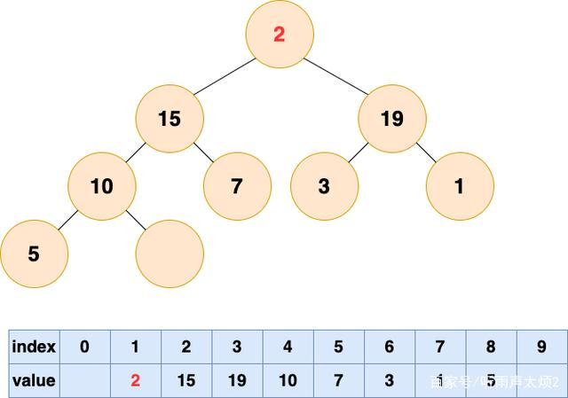
**我们选择比较当前子树的左节点和右节点，取三者最大值放到根上。如果当前根不是最大值，交换继续check被调整子树。**
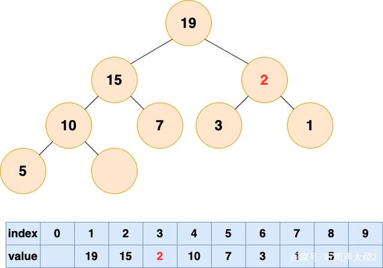
**继续执行上述操作。**
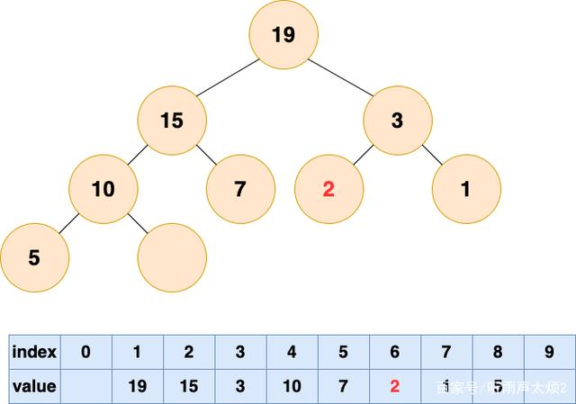
#### **建堆的算法**
从最后一层的父节点（非叶子节点）开始，执行向下调整算法。（只不过不需要交换）
复杂度是O(n)。
```C++
class Solution {
public:
    //向下调整算法
    void Delete(vector<int>& nums, int rt, int n){
        int lchild=rt<<1|1, biggest = lchild;
        if(biggest >= n)return;
        if(lchild + 1<n&&nums[lchild]<nums[lchild+1]){
            biggest = lchild+1;
        }
        if(nums[biggest]>nums[rt]){
            swap(nums[biggest],nums[rt]);
            Delete(nums, biggest, n);
        }
    }
    //向上调整算法
    void Insert(vector<int>& nums,int rt){
        int p = rt/2 - (rt%2==0);
        if(p>=0 && nums[p]<nums[rt]){
            swap(nums[p],nums[rt]);
            Insert(nums, p);
        }
    }
    void show(vector<int>& nums, int n){
        for(int i = 0; i < n; i++){
            printf("%d ",nums[i]);
        }
        printf("\n");
    }
    int findKthLargest(vector<int>& nums, int k) {
        int n = nums.size();
        //从最后一层的父节点开始扫描
        for(int i = floor(n/2) - 1; i>=0; i--){
            Delete(nums, i, n);
        }
        while(k--){
            //show(nums, n);
            n--;
            swap(nums[n],nums[0]);
            Delete(nums, 0, n);
        }
        return nums[n];
    }
};
```
#### **小顶堆解决TopK问题**
* **什么是TopK问题？**
  * 就是快速找出在无序的大数据中最大的K个元素的问题。
  * 解决方法：维护大小为K的小顶堆、直接建大顶堆一个一个删除、快排分区。
* **解法一、维护大小为K的小顶堆**
  * **step 1**.维护一个大小为K的小顶堆，可以取数组的前K个元素先建堆。
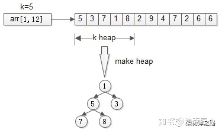
  * **step 2**.然后依次检查[K+1,n]，接着，从第k+1个元素开始扫描，和堆顶（堆中最小的元素）比较，如果被扫描的元素大于堆顶，则替换堆顶的元素，并调整堆，以保证堆内的k个元素，总是当前最大的k个元素。
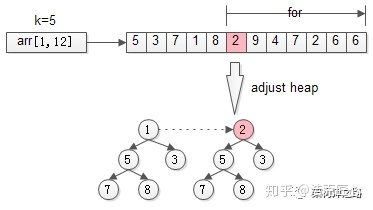
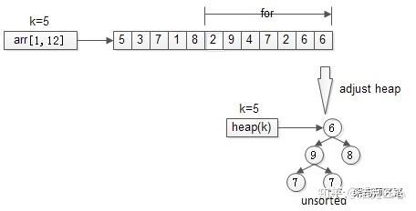
```C++
class Solution {
public:
    void Delete(vector<int>& nums, int rt, int n){
        int lchild=rt<<1|1, biggest = lchild;
        if(biggest >= n)return;
        if(lchild + 1<n&&nums[lchild]>nums[lchild+1]){
            biggest = lchild+1;
        }
        if(nums[biggest]<nums[rt]){
            swap(nums[biggest],nums[rt]);
            Delete(nums, biggest, n);
        }
    }
    void Insert(vector<int>& nums,int rt){
        int p = rt/2 - (rt%2==0);
        if(p>=0 && nums[p]<nums[rt]){
            swap(nums[p],nums[rt]);
            Insert(nums, p);
        }
    }
    void show(vector<int>& nums, int n){
        for(int i = 0; i < n; i++){
            printf("%d ",nums[i]);
        }
        printf("\n");
    }
    int findKthLargest(vector<int>& nums, int k) {
        int n = nums.size();
        vector<int> arr;
        arr.assign(nums.begin(), nums.begin()+k);
        int m=k;
        for(int i=floor(m)/2-1;i>=0;i--){
            Delete(arr, i, m);
        }
        for(int i=k;i<n;i++){
            if(nums[i]>arr[0]){
                arr[0] = nums[i];
                Delete(arr, 0, m);
            }
        }
        return arr[0];
    }
};
```
* **解法二、直接建大顶堆**
  * 上述建堆算法就是。。
##### **追问：是否还有其他方法可以解决TopK问题？**
快排分区算法！
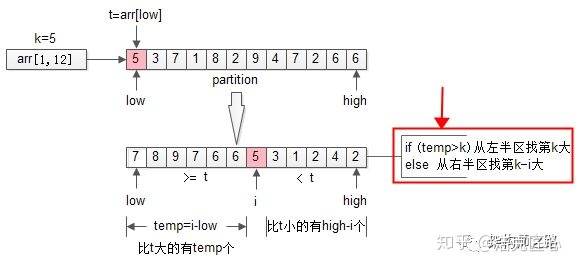
```C++
class Solution {
public:
    int Partion(vector<int>& nums, int l, int r){
        int item = nums[l];
        int ll=l,rr=r;
        while(l<r){
            while(l<r&&nums[r]<item)r--;
            if(l<r&&nums[r]>=item)swap(nums[l++],nums[r]);
            while(l<r&&nums[l]>item)l++;
            if(l<r&&nums[l]<=item)swap(nums[l],nums[r--]);
        }
        nums[l] = item;
        return l;
    }
    int getKthNumber(vector<int>& nums, int l, int r, int k){
        int mid=Partion(nums, l, r);
        if(mid == k-1)return nums[mid];
        if(mid >= k)return getKthNumber(nums, l, mid - 1, k);
        else return getKthNumber(nums, mid + 1, r, k);
    }
    int findKthLargest(vector<int>& nums, int k) {
        int n = nums.size();
        return getKthNumber(nums, 0, n-1, k);
    }
};
```
## **并发编程**
### **信号量**
* **std::mutex**
  * A mutex is a lockable（**可加锁的**） object that is designed to signal（**信号**） when critical sections of code（**临界代码段**） need exclusive access, preventing other threads with the same protection from executing concurrently and access the same memory locations.
  * 常见操作：**std::mutex m_lock**、**m_lock.lock()**、**m_lock.unlock()**。
* **std::shared_mutex**
  * 共享 (读)- 多个线程能共享同一互斥的所有权。
  * 独占性（写）- 仅一个线程能占有互斥。
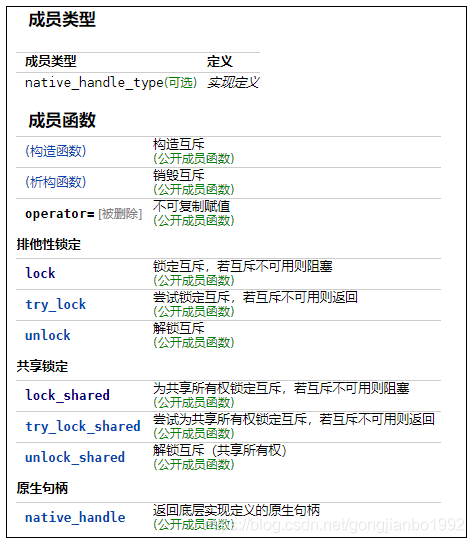
### **锁**
* **std::unique_lock**
  * std::unique_lock是互斥锁，他是对std::mutex或者std::shared_mutex加上互斥锁，可以独占该互斥变量。
* **std::shared_lock**
  * std::shared_lock是读锁，他是对std::shared_mutex加上读锁，其他读线程或者写进程仍然可以访问该std::shared_mutex。
* **与信号量的不同**
  * 信号量加锁和释放都需要自己来。
  * 而锁则是构造时候加锁，析构就解锁。
### **std::condition_variable**
* **概念**：多线程访问一个共享资源（或称临界区），不仅需要用互斥锁实现独享访问避免并发错误，在获得互斥锁进入临界区后，有时还需检查特定条件是否成立。**如果不成立，则解锁该mutex，进入等待队列等待唤醒**。当某个线程修改测试条件后，将通知其它正在等待条件的线程继续往下执行，**并对该mutex再次加锁**。
* **作用**：条件变量需要和一个互斥锁绑定，这个互斥锁的作用为：
  * a. 互斥地访问临界资源。 
  * b. 保护测试条件。
### **std::future**
* **概念**：C++11中的std::future是一个模板类。std::future提供了一种用于访问异步操作结果的机制。
* **重点函数(get)**：
  * (1).当共享状态就绪时，返回存储在共享状态中的值(或抛出异常)。
  * (2).如果共享状态尚未就绪(即提供者尚未设置其值或异常)，则该函数将阻塞调用的线程直到就绪。
  * (3).当共享状态就绪后，则该函数将取消阻塞并返回(或抛出)释放其共享状态，这使得future对象不再有效，因此对于每一个future共享状态，该函数最多应被调用一次。
  * (4).std::future<void>::get()不返回任何值，但仍等待共享状态就绪并释放它。
  * (5).共享状态是作为原子操作(atomic operation)被访问。
### **std::thread**
* 创建线程比较简单，C++提供头文件thread，使用std的thread实例化一个线程对象创建。
* std::thread 在 #include 头文件中声明，因此使用 std::thread 时需要包含 #include 头文件。
* 线程的同步：在结束线程时需要调用joinable的函数，看能否join到当前线程中，而后使用join接口，join的作用是让主线程等待直到该子线程执行结束。使用join后的线程，此时再次调用joinable函数返回值是false

## **设计模式**
### **单例模式**
* **按创建时刻划分**：
  * **懒汉式**
  * **饥汉式**
* **按是否有锁划分**：
  * **加锁式**
  * **无锁式**

## **参考资料**
* [字节跳动 提前批C++开发一面面经 →【鹿の面经解答】](https://www.nowcoder.com/discuss/981246)
* [Linux下内存问题检测神器：Valgrind](https://zhuanlan.zhihu.com/p/75328270)
* [memcpy函数的实现](https://blog.csdn.net/lswfcsdn/article/details/122066079)
* [C++编译过程](https://zhuanlan.zhihu.com/p/497491709)
* [条件编译#ifdef的详解](https://blog.csdn.net/weixin_52244492/article/details/123982193)
* [动态链接库.so和静态链接库.a的区别](https://blog.51cto.com/u_13097817/2047647)
* [linux gdb调试命令详解](https://blog.csdn.net/strut/article/details/120309034)
* [gdb 查看函数调用堆栈（frame概念）](http://t.zoukankan.com/xiaoshiwang-p-12893748.html)
* [第8篇:C++哈希表-负载系数与重散列](https://www.jianshu.com/p/88577087957e/)
* [C++ std::unordered_map](https://blog.csdn.net/u013271656/article/details/113810084)
* [push_back和emplace_back区别](https://blog.csdn.net/bureau123/article/details/123417471)
* [push_back 和 emplace_back 的差异，清晰易懂！](https://blog.csdn.net/pengjian444/article/details/116740246)
* [std::condition_variable详解](https://www.cnblogs.com/yanghh/p/12995084.html)
* [C++11中std::future的使用](https://blog.csdn.net/fengbingchun/article/details/104115489)